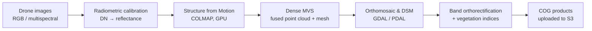

# DIPAL — Drone Image Processing & Analysis Library

DIPAL is a photogrammetry toolkit that turns drone imagery into 3D reconstructions and geospatial map products. It was built by [Sensifai](https://sensifai.com/en/portfolio/dipal) under the **SPADE programme (Open Call #2)**. The goal is to make geospatial processing faster, cheaper, and easier to plug into downstream workflows such as farm management systems.

You upload a set of drone images (RGB or multispectral). DIPAL returns georeferenced orthomosaics, elevation models, point clouds, meshes, and vegetation-index maps. All raster outputs are Cloud-Optimized GeoTIFFs that work in standard GIS tools.

> Internally the platform is also called **PhotoGear**, so you'll see that name in service names, Docker images, and some docs.

---

## What it produces

| Category | Products |
|---|---|
| 2D rasters | Orthomosaic (plus 2×/4×/8× downsampled COGs), DSM, DEM, hillshade |
| 3D | Dense point cloud (local frame and **UTM**), Poisson mesh, sparse and dense reconstructions |
| Multispectral | Calibrated reflectance, per-band orthorectified rasters, multiband stack, **NDVI**, **NDRE**, **GNDVI** |

## Processing pipeline



1. **Radiometric calibration.** Detects spectral bands from EXIF/XMP metadata (DJI, MicaSense, Parrot Sequoia, Sentera, …) and converts raw digital numbers to float32 reflectance per band.
2. **Structure from Motion.** Uses COLMAP/pycolmap on the GPU for SIFT extraction, matching, incremental reconstruction, and bundle adjustment. GSD-aware settings pick the reconstruction resolution.
3. **Dense reconstruction.** Builds a fused point cloud and a Poisson mesh, then georeferences them to ECEF and UTM with PDAL.
4. **Orthomosaic generation.** Projects imagery onto the DSM grid from the camera poses to produce an orthomosaic, a DSM, and multi-resolution COGs.
5. **Multispectral analysis** (`full` mode only). Orthorectifies each band onto the same grid, stacks the bands, and computes NDVI, NDRE, and GNDVI.

There are two **analysis modes**:
- `fast`: RGB only, with GSD doubled so reconstruction runs much faster.
- `full`: RGB plus the full multispectral pipeline.

## Architecture

```
┌──────────────┐    ┌──────────────────────────────┐
│   Frontend   │──▶│  Backend (Django / DRF)  :8000 │  users, orgs, uploads, jobs,
└──────────────┘    │  Celery + Redis, Channels (WS) │  products, FMIS webhooks
                    └───────────────┬───────────────┘
                                    │ POST /jobs/run  ◀── progress callbacks
                    ┌───────────────▼───────────────┐
                    │  API Gateway (FastAPI)  :8080  │  orchestration, retries,
                    └──┬──────────────┬───────────┬──┘  product upload
                       ▼              ▼           ▼
               ┌────────────┐  ┌──────────┐  ┌──────────────┐
               │ Calibration│  │   SfM    │  │ Orthomosaic  │
               │   :8001    │  │  :8002   │  │    :8003     │
               └────────────┘  └──────────┘  └──────────────┘
                              S3 (inputs & products)  ·  Redis (job state)
```

The stages are chained by callbacks: each service reports back to the gateway, and the gateway starts the next stage. Job state lives in Redis, so a failed job can be **retried or resumed** from the last completed stage.

## Repository layout

| Directory | Description |
|---|---|
| [`image-analysis-core/`](image-analysis-core/) | Processing microservices (API gateway, calibration, SfM, orthomosaic), shared libraries (band detection, COLMAP readers, storage drivers), a benchmark suite, and a local pipeline runner. Python 3.12+. |
| [`backend-core/`](backend-core/) | Django 5.2 REST API with JWT auth, multi-tenant organizations, chunked/multipart uploads to S3, job and processing tracking, product catalogue and visualization endpoints, FMIS integrations and webhooks, and Prometheus metrics. PostgreSQL/PostGIS, Celery, Channels. |
| [`infrastructure-core/`](infrastructure-core/) | Terraform for AWS: VPC, ECS Fargate, RDS PostgreSQL, ElastiCache, S3/KMS, ECR, and AWS Batch GPU (`g4dn`) for SfM, plus CI/CD through GitLab webhooks → CodePipeline → CodeBuild, and CloudWatch monitoring. |
| `frontend-core/` | Web client (not included in this checkout). |

## Quick start

### Run the pipeline locally, without services

This is the fastest way to process a dataset on one machine. It needs no API, S3, or Redis.

```bash
cd image-analysis-core
pip install -e .
python run_local_pipeline.py \
    --dataset-dir /path/to/raw/images \
    --work-dir    /tmp/dipal_run \
    --dataset-id  my_dataset \
    --stages      calibration,sfm,orthomosaic \
    --mode        full \
    --gsd         5.0
```

Pick the stages you need with `--stages`. For example, `--stages sfm,orthomosaic` resumes a run after calibration.

### Run the processing services with Docker

```bash
cd image-analysis-core
cp .env.example .env
docker network create image_processing_network
docker compose --env-file .env up --build
```

Interactive gateway API docs: <http://localhost:8080/docs>. SfM needs an NVIDIA GPU with CUDA to run at full speed.

### Run the backend

```bash
cd backend-core
docker compose up --build        # PostgreSQL/PostGIS, Redis, Django, Celery worker
make createsuperuser
```

- API: <http://localhost:8000/v1/>
- Admin: <http://localhost:8000/admin/>
- OpenAPI docs: <http://localhost:8000/api/docs/> (plus ReDoc at `/api/redoc/`)

The backend and the processing services share the `image_processing_network` Docker network.

### Deploy to AWS

See [`infrastructure-core/QUICKSTART.md`](infrastructure-core/QUICKSTART.md) and [`infrastructure-core/ARCHITECTURE.md`](infrastructure-core/ARCHITECTURE.md).

## Benchmarking

`image-analysis-core/benchmark/` compares the pipeline against public drone datasets. It includes download scripts for Aukerman, DroneMapper, Zenodo, and Dataverse. It runs each stage and checks the results for spatial accuracy, radiometric consistency, vegetation-index sanity, visual quality, and performance. It can also run COLMAP and OpenSfM baselines. See [`benchmark/readme.md`](image-analysis-core/benchmark/readme.md).

## Tech stack

**Photogrammetry:** COLMAP / pycolmap 3.13, GDAL 3.12, PDAL 2.9, OpenCV, NumPy
**Services:** FastAPI, Pydantic, Redis, boto3 (S3 with presigned URLs)
**Backend:** Django 5.2, DRF, SimpleJWT, Celery, Channels, PostgreSQL 17 + PostGIS, drf-spectacular, django-prometheus
**Infra:** Docker, Terraform, AWS (ECS Fargate, Batch GPU, RDS, ElastiCache, S3, CodePipeline, CloudWatch), Grafana

## Documentation

- Processing system: [`image-analysis-core/docs/`](image-analysis-core/docs/README.md), which covers architecture, [job processing flow](image-analysis-core/docs/JOB_PROCESSING_FLOW.md), [retry system](image-analysis-core/docs/JOB_RETRY_SYSTEM.md), [multispectral analysis](image-analysis-core/docs/services/MULTISPECTRAL_ANALYSIS.md), ADRs, and changelogs
- Backend API: [`backend-core/docs/`](backend-core/docs/) (API spec, ERD, Postman collection, FMIS/AI integration)
- Infrastructure: [`infrastructure-core/README.md`](infrastructure-core/README.md)

## Acknowledgements

DIPAL was developed by [Sensifai](https://sensifai.com) with funding from the **SPADE** project's Open Call #2. SPADE is funded by the European Union's Horizon Europe programme. Source is hosted at Eclipse Research Labs (`gitlab.eclipse.org/eclipse-research-labs/spade-project/opencall-2/dipal`).

## License

Each component states its own license terms. Check the individual sub-projects before redistributing.
