# PhotoGear Entity Relationship Diagram (ERD)

```mermaid
erDiagram
    ORGANIZATIONS {
        uuid id PK
        string name
        text description
        timestamp created_at
        timestamp updated_at
    }

    USERS {
        uuid id PK
        uuid org_id FK
        string email
        string name
        string auth_provider
        string sub
        string status
        timestamp created_at
        timestamp updated_at
    }

    ROLES {
        uuid id PK
        uuid org_id FK
        string name
        jsonb permissions
        timestamp created_at
    }

    USER_ROLES {
        uuid user_id FK
        uuid role_id FK
        timestamp assigned_at
    }

    DATASETS {
        uuid id PK
        uuid org_id FK
        string name
        string platform
        timestamp capture_start
        timestamp capture_end
        string crs
        geometry bbox
        text notes
        timestamp created_at
        timestamp updated_at
    }

    IMAGES {
        uuid id PK
        uuid dataset_id FK
        string uri
        string checksum
        timestamp captured_at
        string band
        integer width
        integer height
        float gsd
        jsonb exif
        jsonb imu
        timestamp created_at
    }

    CALIBRATIONS {
        uuid id PK
        uuid dataset_id FK
        string panel_type
        jsonb params
        timestamp performed_at
        string operator
        jsonb qc
        timestamp created_at
    }

    JOBS {
        uuid id PK
        uuid dataset_id FK
        enum type
        enum status
        uuid submitted_by FK
        jsonb params
        jsonb metrics
        string logs_uri
        timestamp created_at
        timestamp started_at
        timestamp finished_at
    }

    PRODUCTS {
        uuid id PK
        uuid dataset_id FK
        uuid job_id FK
        enum type
        string uri
        geometry footprint
        float resolution_cm
        text[] bands
        jsonb stats
        timestamp created_at
    }

    WEBHOOKS {
        uuid id PK
        uuid org_id FK
        string url
        string secret
        text[] events
        boolean active
        timestamp created_at
    }

    AUDIT {
        uuid id PK
        uuid org_id FK
        uuid actor_id FK
        string action
        string resource
        string resource_id
        timestamp timestamp
        jsonb payload
    }

    %% Relationships with colored connections
    ORGANIZATIONS ||--o{ USERS : "belongs_to"
    ORGANIZATIONS ||--o{ ROLES : "has"
    ORGANIZATIONS ||--o{ DATASETS : "owns"
    ORGANIZATIONS ||--o{ WEBHOOKS : "configures"
    ORGANIZATIONS ||--o{ AUDIT : "tracks"
    
    USERS ||--o{ USER_ROLES : "assigned"
    ROLES ||--o{ USER_ROLES : "granted"
    USERS ||--o{ JOBS : "submits"
    USERS ||--o{ AUDIT : "performs"
    
    DATASETS ||--o{ IMAGES : "contains"
    DATASETS ||--o{ CALIBRATIONS : "has"
    DATASETS ||--o{ JOBS : "processes"
    DATASETS ||--o{ PRODUCTS : "generates"
    
    CALIBRATIONS ||--o{ JOBS : "uses"
    JOBS ||--o{ PRODUCTS : "produces"

    %% Enhanced styling with better readability
    %%{init: {
        'theme': 'base',
        'themeVariables': {
            'background': '#ffffff',
            'primaryColor': '#2563eb',
            'primaryTextColor': '#1f2937',
            'primaryBorderColor': '#374151',
            'lineColor': '#059669',
            'secondaryColor': '#f3f4f6',
            'tertiaryColor': '#6b7280',
            'mainBkg': '#f9fafb',
            'secondBkg': '#ffffff',
            'tertiaryBkg': '#e5e7eb',
            'entityBkg': '#ffffff',
            'entityTextColor': '#111827',
            'entityBorderColor': '#374151',
            'relationLabelColor': '#7c2d12',
            'relationLabelBackground': '#fef3c7',
            'fontSize': '14px'
        }
    }}%%

    %% Clean entity definitions without redundant FKs
    ORGANIZATIONS {
        uuid id PK
        string name
        text description
        timestamp created_at
        timestamp updated_at
    }

    USERS {
        uuid id PK
        string email
        string name
        string auth_provider
        string sub
        string status
        timestamp created_at
        timestamp updated_at
    }

    ROLES {
        uuid id PK
        string name
        jsonb permissions
        timestamp created_at
    }

    USER_ROLES {
        timestamp assigned_at
    }

    DATASETS {
        uuid id PK
        string name
        string platform
        timestamp capture_start
        timestamp capture_end
        string crs
        geometry bbox
        text notes
        timestamp created_at
        timestamp updated_at
    }

    IMAGES {
        uuid id PK
        string uri
        string checksum
        timestamp captured_at
        string band
        integer width
        integer height
        float gsd
        jsonb exif
        jsonb imu
        timestamp created_at
    }

    CALIBRATIONS {
        uuid id PK
        string panel_type
        jsonb params
        timestamp performed_at
        string operator
        jsonb qc
        timestamp created_at
    }

    JOBS {
        uuid id PK
        enum type
        enum status
        jsonb params
        jsonb metrics
        string logs_uri
        timestamp created_at
        timestamp started_at
        timestamp finished_at
    }

    PRODUCTS {
        uuid id PK
        enum type
        string uri
        float resolution_cm
        text bands
        jsonb stats
        timestamp created_at
    }

    WEBHOOKS {
        uuid id PK
        string url
        string secret
        text events
        boolean active
        timestamp created_at
    }

    AUDIT {
        uuid id PK
        string action
        string resource
        string resource_id
        timestamp timestamp
        jsonb payload
    }
```

## Entity Descriptions

### ORGANIZATIONS
- **Purpose**: Multi-tenant organization structure
- **Key Indexes**: `id` (PK), `name` (unique)
- **Notes**: Root entity for org-scoped access control

### USERS
- **Purpose**: User accounts with OIDC integration
- **Key Indexes**: `id` (PK), `email` (unique per org), `auth_provider + sub` (unique)
- **Notes**: Supports multiple auth providers (Cognito, Keycloak); org relationship via FK

### ROLES & USER_ROLES
- **Purpose**: Role-based access control (RBAC)
- **Key Indexes**: `roles.id` (PK), composite `(user_id, role_id)` (PK) in USER_ROLES
- **Notes**: Many-to-many relationship for flexible permission assignment; org relationship via FK

### DATASETS
- **Purpose**: Container for drone imagery collections
- **Key Indexes**: `id` (PK), PostGIS spatial index on `bbox`
- **Notes**: `bbox` is PostGIS geometry (Polygon, EPSG:4326) for spatial queries; org relationship via FK

### IMAGES
- **Purpose**: Individual image metadata and references
- **Key Indexes**: `id` (PK), `checksum` (unique), `captured_at`
- **Notes**: EXIF/IMU stored as JSONB for flexible metadata; dataset relationship via FK

### CALIBRATIONS
- **Purpose**: Radiometric calibration parameters per dataset
- **Key Indexes**: `id` (PK), `performed_at`
- **Notes**: QC results stored as JSONB for validation metrics; dataset relationship via FK

### JOBS
- **Purpose**: Processing job tracking and orchestration
- **Key Indexes**: `id` (PK), `status`, `created_at`
- **Notes**: 
  - Type enum: `preprocess`, `orthomosaic`, `recon3d`
  - Status enum: `pending`, `running`, `failed`, `succeeded`, `canceled`
  - Relationships to dataset and user via FK

### PRODUCTS
- **Purpose**: Generated outputs from processing jobs
- **Key Indexes**: `id` (PK), PostGIS spatial index on `footprint`
- **Notes**: 
  - Type enum: `orthomosaic`, `dem`, `dsm`, `pointcloud`, `mesh`, `preview`
  - `footprint` is PostGIS geometry (Polygon, EPSG:4326)
  - Relationships to dataset and job via FK

### WEBHOOKS
- **Purpose**: External system integration endpoints
- **Key Indexes**: `id` (PK), `url`
- **Notes**: Events array for filtering webhook triggers; org relationship via FK

### AUDIT
- **Purpose**: Comprehensive audit trail for compliance
- **Key Indexes**: `id` (PK), `timestamp`, `action`
- **Notes**: Tracks all system actions with detailed payload; org and user relationships via FK

## Data Types Legend

- **uuid**: UUID v4 primary/foreign keys
- **string**: VARCHAR(255) unless noted
- **text**: Unlimited text
- **enum**: PostgreSQL enum type
- **jsonb**: PostgreSQL JSONB for structured data
- **geometry**: PostGIS geometry type
- **text[]**: PostgreSQL text array
- **timestamp**: PostgreSQL timestamp with timezone

## Key Constraints

1. **Foreign Key Constraints**: All FK relationships enforced
2. **Unique Constraints**: 
   - `users.email` per organization
   - `images.checksum` globally
   - `organizations.name` globally
3. **Check Constraints**:
   - `jobs.status` transitions follow state machine
   - `products.resolution_cm` > 0
   - `images.width, height` > 0
4. **Spatial Constraints**:
   - `datasets.bbox` must be valid polygon
   - `products.footprint` must be valid polygon

## Indexing Strategy

### Primary Indexes
- B-tree indexes on all primary keys
- B-tree indexes on all foreign keys
- B-tree indexes on frequently queried columns (`status`, `created_at`, etc.)

### Spatial Indexes
- GiST indexes on PostGIS geometry columns (`bbox`, `footprint`)
- Enables efficient spatial queries and intersection operations

### JSONB Indexes
- GIN indexes on JSONB columns for metadata queries
- Supports efficient queries on nested JSON structures

### Composite Indexes
- `(org_id, created_at)` for time-series queries
- `(dataset_id, type, status)` for job/product filtering
- `(org_id, timestamp)` for audit log queries
