# PhotoGear - Structure from Motion Pipeline

## PyCOLMAP
A comprehensive Structure from Motion (SfM) pipeline using pycolmap for 3D reconstruction from image sequences.

### Features

- **Feature Extraction**: SIFT feature detection with GPU acceleration
- **Feature Matching**: Exhaustive matching with cross-checking
- **Sparse Reconstruction**: Bundle adjustment and triangulation
- **Dense Reconstruction**: Dense point cloud generation (optional)
- **Export Options**: PLY point clouds and camera poses
- **Smart Database Management**: Reuses existing features when available

### Installation

1. Install dependencies:
```bash
pip install -r requirements.txt
```

# COLMAP
## Docker installation
The Docker installation had been chosen for COLMAP, as it is the most straightforward way to get it running on any system. For installation information, please visit the [COLMAP GitHub repository](https://github.com/colmap/colmap/tree/main/docker)
After running the container and mounting the dataset folder, you can run COLMAP commands inside the container.
In order to generate he dense point cloud:
```bash
colmap automatic_reconstructor \
    --workspace_path /path/to/your/dataset \
    --image_path /path/to/your/dataset/images \
```
The COLMAP will identify the CUDA device automatically, and run the CUDA available processes on the GPU.

## Processing steps
The COLMAP pipeline consists of the following steps:

```mermaid
flowchart LR
	A[Images] --> B[Feature Extraction]
	B[Feature Extraction] --> C[Matching]
	C --> D[Geometric Verification]
	D --> E[Initialization]
	E --> F[Image Registration]
	F --> G[Triangulation]
	G --> H[Bundle Adjestment]
	H --> I[Outlier Filtering]
	I --> F
	I --> J[Reconstruction]

	classDef Images fill:#90e0ef,stroke:#0077b6,color:#03045e;
	classDef Correspondence_Search fill:#ffd166,stroke:#ef476f,color:#6a040f;
	classDef Incremental_Reconstruction fill:#caffbf,stroke:#38b000,color:#004b23;

	class A Images
	class B,C,D Correspondence_Search
	class E,F,G,H,I Incremental_Reconstruction

%%{
init: {"themeVariables":{
"lineColor": "#ffffff"
}}
}%%
```



# OpenSfM
[Clone the repository and build the docker image](https://github.com/mapillary/OpenSfM/blob/main/Dockerfile).
Then run the container and mount the dataset folder.
```bash
docker run -p 8080:8080 -v $(pwd)/data:/source/OpenSfM/data -it opensfm:latest bash
```
By this command the OpenSfM will run the whole pipeline on your images dataset.
```bash
./bin/opensfm_run_all <DATASET_PATH>
```
The OpenSfM pipeline consists of the following steps:
1.  `extract_metadata`: Extracts camera and GPS information from the EXIF data of the images.
2.  `detect_features`: Detects keypoints and computes descriptors for each image.
3.  `match_features`: Matches the detected features between pairs of images.
4.  `create_tracks`: Links the matches across multiple images to form consistent tracks.
5.  `reconstruct`: Performs the core sparse reconstruction to create the 3D point cloud and determine camera poses.
6.  `mesh`: Generates a simplified 3D mesh from the sparse point cloud.
7.  `undistort`: Creates undistorted versions of the images and the reconstruction.
8.  `compute_depthmaps`: Computes depth maps for each image, which is the first step for dense reconstruction.

```mermaid
flowchart LR
    A[Images] --> B[Extract Metadata]
    B --> C[Detect Features]
    C --> D[Match Features]
    D --> E[Create Tracks]
    E --> F[Reconstruct]
    F --> G[Mesh Generation]
    G --> H[Undistort Images]
    H --> I[Compute Depthmaps]

    classDef Images fill:#90e0ef,stroke:#0077b6,color:#03045e;
    classDef Feature_Extraction fill:#ffd166,stroke:#ef476f,color:#6a040f;
    classDef Reconstruction fill:#caffbf,stroke:#38b000,color:#004b23;

    class A Images
    class B,C,D Feature_Extraction
    class E,F,G,H,I Reconstruction
%%{
init: {"themeVariables":{
"lineColor": "#ffffff"
}}
}%%
```



# MVE
## Docker installation
Clone the MVE repository and build the docker image ([link](https://github.com/simonfuhrmann/mve)):

```bash
docker build -t mve:latest .
```
Then run with:
```bash
docker run -v $(pwd):/data -it mve:latest bash
```

### Generate the result with:

```bash
./bin/makescene/makescene -i <image-dir> <scene-dir>
./bin/sfmrecon/sfmrecon <scene-dir>
./bin/dmrecon/dmrecon -s2 <scene-dir>
./bin/scene2pset/scene2pset -F2 <scene-dir> <scene-dir>/pset-L2.ply
./bin/fssrecon/fssrecon <scene-dir>/pset-L2.ply <scene-dir>/surface-L2.ply
./bin/meshclean/meshclean -t10 <scene-dir>/surface-L2.ply <scene-dir>/surface-L2-clean.ply
```
---

# PDAL
## Installation
In your conda environment, run:
```bash
conda install --channel conda-forge pdal
```

The PDAL is used to process the point clouds, e.g. downsampling, filtering, and converting to `gdal` format.
## Example usage
This is the pipeline configuration file `pipeline.json`:
```json
{
  "pipeline": [
    "data/reconstruction.ply",
    {
      "type": "writers.gdal",
      "filename": "data/dsm.tif",
      "resolution": 1.0,
      "output_type": "max",
      "radius": 0.5
    }
  ]
}
```
The point cloud file is the `data/reconstruction.ply`, and the output is the `data/dsm.tif` file.
Then run:
```bash
pdal pipeline pipeline.json
```

# GDAL
## Installation
In your conda environment, run:
```bash
conda install --channel conda-forge gdal
```


```commandline
gdal_translate data/farm/dsm_filled.tif data/farm/dsm_filled_cog.tif -of COG
gdal_fillnodata -md 5 data/farm/dsm.tif data/farm/dsm_filled.tif
IGNORE_COG_LAYOUT_BREAK="YES" gdal_edit -a_srs EPSG:4326 dsm_filled_cog.tif
gdal_edit -a_srs EPSG:4326 dsm_filled_cog.tif
```

# Installation
## Setup `env` configuration

- Create `.env` file like the `.env.example`
- Set the services host and ports in `.env`


## Install dockers

To install and run the docker containers:
```bash
docker compose --env-file .env up --build
```
